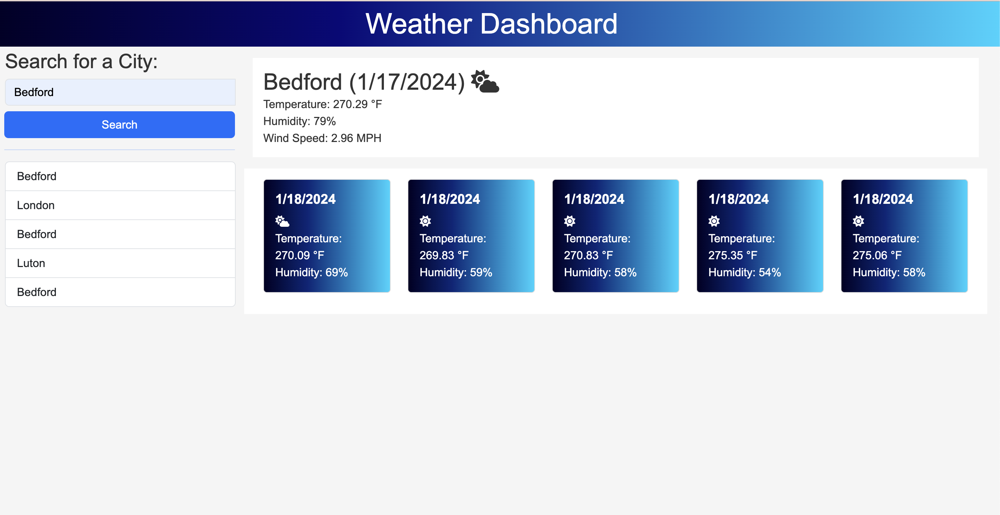

# Weather Dashboard

A simple weather dashboard application that allows users to check the current and forecasted weather conditions for multiple cities.

## Table of Contents

- [Introduction](#introduction)
- [Features](#features)
- [Technologies Used](#technology)
- [Getting Started](#getting-started)
- [Usage](#usage)
- [Screenshots](#screenshots)
- [Deployment](#deployment)
- [Contributing](#contributing)
- [About Me](#aboutme)
- [License](#license)

## Introduction

A simple weather dashboard application that allows users to check the current and forecasted weather conditions for multiple cities.

## Features

- Search for the weather of any city.
- View current weather conditions including temperature, humidity, and wind speed.
- Display a 5-day weather forecast.
- Save and view search history.
- Responsive design for various screen sizes.

## Technologies Used

- HTML
- CSS
- JavaScript
- OpenWeatherMap API key.
- Bootstrap
- Fontawsome
- Dayjs

## Getting Started

To get started with Coding Quiz Challenge, follow these steps:

1. Clone this repository to your local machine.

```bash
  git clone https://github.com/EDXBootcamp/Weather-Dashboard.git
```

2. Open the `index.html` file in a web browser.

## Usage

1. Open `index.html` in a web browser.
2. Search for a City
3. Enter the city name in the search input field.
4. Click the "Search" button or press Enter.

## Screenshots



## Deployment

The application is deployed and accessible online. Visit the live version [here](https://edxbootcamp.github.io/Weather-Dashboard/).

## Contributing

If you would like to contribute to this project, please follow these steps:

1. Fork the repository.
2. Create a new branch for your feature or improvement.
3. Make changes and submit a pull request.

## 🚀 About Me

I'm a full stack developer...

## 🔗 My Links

[](https://github.com/tjthouhid//)
[](https://www.linkedin.com/in/tjthouhid)
[](https://twitter.com/tjthouhid)

## License

This project is licensed under the [MIT License](LICENSE).
